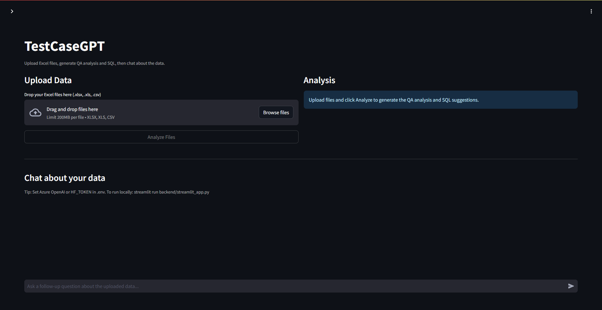
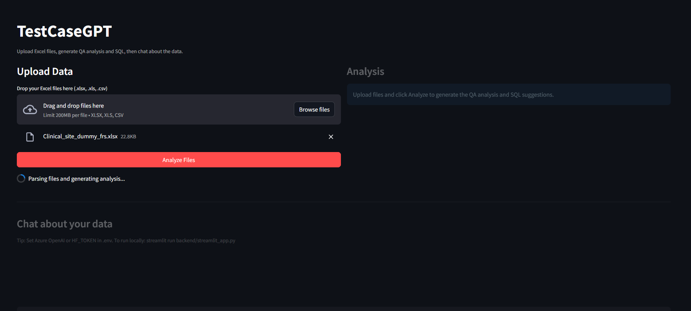
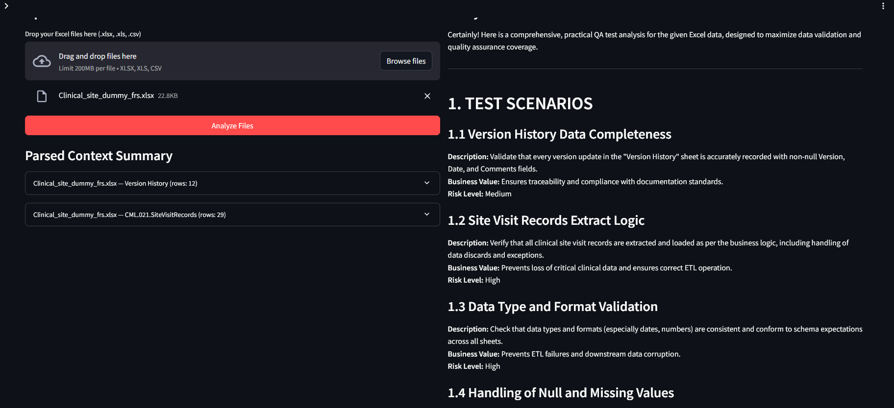
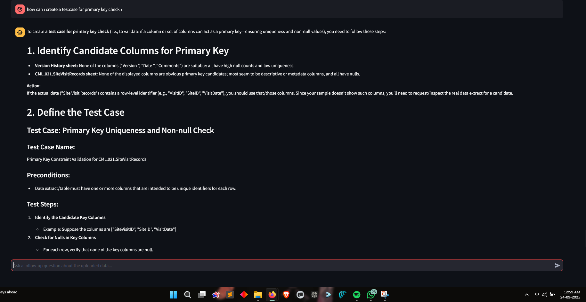

# 🧪 TestCase GPT - AI-Powered Excel Test Analysis Tool

An intelligent test analysis tool that leverages AI/LLM models to analyze Excel documents and generate comprehensive test scenarios, test cases, SQL queries, and quality assurance documentation. Perfect for QA engineers, database developers, and testing teams.

## APP DEMO




# watch the demo here -> 
[Watch Demo](https://www.youtube.com/watch?v=fDAqbBDxe60)


## 🎯 Features

- **🤖 AI-Powered Analysis**: Uses multiple LLM models (HuggingFace, Groq, Azure OpenAI)
- **📊 Excel Document Parsing**: Analyzes database specs and column mapping sheets
- **🧪 Automated Test Generation**: Creates detailed test scenarios and test cases
- **🔍 SQL Query Generation**: Generates validation queries for data integrity testing
- **📈 Data Quality Analysis**: Identifies potential data issues and validation rules
- **💬 Interactive Q&A**: Ask specific questions about your data and testing strategies
- **🔒 Security-First**: Environment variable-based configuration, no hardcoded secrets
- **🏢 Enterprise Ready**: Works behind corporate firewalls with SSL bypass options

## 🚀 Quick Start

### Prerequisites

- Python 3.8 or higher
- Virtual environment (recommended)
- Excel files to analyze

### Installation

1. **Clone the repository:**
```bash
git clone https://github.com/mikan-senpai/testcase-gpt.git
cd testcase-gpt
```

2. **Set up virtual environment:**
```bash
# Create virtual environment
python -m venv virtual

# Activate virtual environment
# Windows:
.\virtual\Scripts\activate
# Linux/Mac:
source virtual/bin/activate
```

3. **Install dependencies:**
```bash
pip install -r requirements-minimal.txt
```

4. **Configure environment variables:**
```bash
# Copy the example file
cp .env.example .env

# Edit .env file with your API keys
# Get HuggingFace token from: https://huggingface.co/settings/tokens
# Get Groq API key from: https://console.groq.com/keys
```

### Basic Usage

1. **Preview your Excel files (optional):**
```bash
python preview_excel.py
```

2. **Run the main analyzer:**
```bash
python simple-llamaindex-analyzer.py
```

3. **Check the output:**
- Results displayed in console
- Saved to `simple_test_analysis.md`
- Interactive Q&A mode available

## 📁 Project Structure

```
testcase-gpt/
├── 📄 simple-llamaindex-analyzer.py    # ⭐ Main analyzer (recommended)
├── 📄 excel-analyzer-llm.py           # Basic analyzer
├── 📄 llamaindex-excel-analyzer.py    # Advanced with vector indexing
├── 📄 preview_excel.py                # Excel file preview tool
├── 📄 streamlit_app.py                # Web UI (Streamlit)
├── 📄 server.py                       # API server
├── 📄 open_ai.py                      # OpenAI integration
├── 🔧 .env.example                    # Environment variables template
├── 🔧 .gitignore                      # Git ignore rules
├── 📋 requirements-*.txt              # Dependency files
├── 📁 models/                         # Model testing scripts
│   ├── 🧪 kimi2.py                   # Kimi model integration
│   ├── 🧪 qroq.py                    # Groq model integration
│   ├── 🧪 hugging-llm.py             # HuggingFace models
│   ├── 🧪 inference.py               # Model inference testing
│   └── 🧪 test_*.py                  # Various test scripts
├── 📁 test-key/                       # Authentication testing
│   ├── 🔑 key_test.py                # HuggingFace login test
│   └── 🔑 model_test.py              # Model connectivity test
├── 📁 sample-document/                # Sample Excel files
│   ├── 📊 Database_Specs_Sheet.xlsx   # Database specifications
│   └── 📊 FRS_Column_Mapping_Sheet.xlsx # Column mapping
├── 📁 database/                       # SQL schema examples
│   ├── 🗃️ database-design-pharma.sql  # Pharma research schema
│   └── 🗃️ database-design-ecommerce.sql # E-commerce schema
└── 📁 virtual/                        # Python virtual environment
```

## 🔧 Configuration

### Environment Variables

Create a `.env` file in the root directory:

```bash
# Hugging Face API Token
# Get from: https://huggingface.co/settings/tokens
HF_TOKEN=your_hf_token_here

# Groq API Key
# Get from: https://console.groq.com/keys
GROQ_API_KEY=your_groq_key_here

# Azure OpenAI (optional)
AZURE_OPENAI_API_KEY=your_azure_key
AZURE_OPENAI_ENDPOINT=https://your-endpoint.openai.azure.com/
AZURE_OPENAI_DEPLOYMENT=your_deployment_name
```

### Model Configuration

The analyzer supports multiple AI models:

1. **HuggingFace Models** (Default: `openai/gpt-oss-20b:fireworks-ai`)
2. **Groq Models** (llama-3.3-70b-versatile)
3. **Azure OpenAI** (GPT-4, GPT-3.5-turbo)

## 📊 Supported Analysis Types

### 1. Database Specification Analysis
- Table structure validation
- Primary/Foreign key relationships
- Data type constraints
- Business rule validation

### 2. Column Mapping Analysis
- Field-level validation rules
- Data transformation testing
- Mapping accuracy verification
- Data quality checks

### 3. Test Case Generation
- **Functional Testing**: Business logic validation
- **Data Integrity**: Referential integrity checks
- **Security Testing**: Authentication and authorization
- **Performance Testing**: Query optimization
- **Edge Case Testing**: Boundary value analysis

## 📤 Output Examples

### Generated Test Scenarios
```markdown
## TEST SCENARIOS

| # | Scenario Name | Risk Level | Business Value |
|---|---------------|------------|----------------|
| 1 | Primary Key Uniqueness | High | Entity identity guarantee |
| 2 | Foreign Key Integrity | High | Prevents orphan records |
| 3 | Mandatory Field Validation | High | Critical data presence |
```

### SQL Validation Queries
```sql
-- Duplicate Primary Keys Check
SELECT id, COUNT(*) AS dup_count
FROM researchers
GROUP BY id
HAVING COUNT(*) > 1;

-- Foreign Key Integrity Check
SELECT r.id
FROM researchers r
LEFT JOIN researcher_types rt ON r.researcher_type_id = rt.id
WHERE rt.id IS NULL;
```

## 🧪 Testing Your Setup

### 1. Test HuggingFace Connection
```bash
python test-key/key_test.py
```

### 2. Test Model Inference
```bash
python models/kimi2.py
```

### 3. Test Groq Integration
```bash
python models/qroq.py
```

### 4. Test Full Analysis
```bash
python simple-llamaindex-analyzer.py
```

## 🌐 Web Interface

Launch the Streamlit web interface:

```bash
streamlit run streamlit_app.py
```

Features:
- File upload interface
- Real-time analysis
- Interactive results viewing
- Export capabilities

## 🔍 Advanced Usage

### Custom Excel Files

Update file paths in the analyzer:

```python
excel_files = [
    "path/to/your/database_specs.xlsx",
    "path/to/your/column_mapping.xlsx"
]
```

### Interactive Analysis

After running the analyzer, use the interactive mode:

```
Your question: Generate test cases for data migration
Your question: What are the critical validation points?
Your question: Suggest performance test scenarios
```

### Batch Processing

Process multiple file sets:

```python
file_sets = [
    ["specs1.xlsx", "mapping1.xlsx"],
    ["specs2.xlsx", "mapping2.xlsx"]
]
```

## 🐛 Troubleshooting

### Common Issues

1. **Token Authentication Error**
   ```
   ❌ HF_TOKEN not found in environment variables!
   ```
   **Solution**: Check your `.env` file and ensure tokens are set correctly.

2. **Model Not Available**
   ```
   The requested model is not supported
   ```
   **Solution**: The script will try alternative models automatically.

3. **SSL Certificate Error**
   ```
   SSL: CERTIFICATE_VERIFY_FAILED
   ```
   **Solution**: Scripts include SSL bypass for corporate environments.

4. **File Not Found**
   ```
   File not found: sample.xlsx
   ```
   **Solution**: Verify file paths and ensure Excel files exist.

### Debug Scripts

Use the debug scripts in the `models/` directory:

- `test_env_loading.py` - Test environment variable loading
- `test_direct_api.py` - Test API connectivity
- `debug_token.py` - Debug token issues

## 🏢 Enterprise Deployment

### Corporate Firewall Setup

1. **Proxy Configuration:**
```python
os.environ['HTTP_PROXY'] = 'http://your-proxy:port'
os.environ['HTTPS_PROXY'] = 'http://your-proxy:port'
```

2. **SSL Configuration:**
```python
# Disable SSL verification (development only)
import ssl
ssl._create_default_https_context = ssl._create_unverified_context
```

### Security Best Practices

- ✅ Environment variables for API keys
- ✅ `.env` file in `.gitignore`
- ✅ No hardcoded secrets in code
- ✅ Token validation and error handling
- ✅ Secure API communication

## 📈 Performance Optimization

### Memory Usage
- **Minimal Mode**: ~200MB RAM
- **Standard Mode**: ~500MB RAM
- **Full Mode**: ~1GB RAM

### Processing Speed
- Small files (<1000 rows): 10-30 seconds
- Medium files (1000-10000 rows): 30-60 seconds
- Large files (>10000 rows): 1-3 minutes

### Optimization Tips
1. Use minimal requirements for faster startup
2. Process files in batches for large datasets
3. Use specific model endpoints for better performance

## 🤝 Contributing

1. Fork the repository
2. Create a feature branch
3. Make your changes
4. Add tests for new functionality
5. Submit a pull request

### Development Setup

```bash
# Install development dependencies
pip install -r requirements-all.txt

# Run tests
python -m pytest tests/

# Format code
black .
```

## 📄 License

This project is licensed under the MIT License - see the LICENSE file for details.

## 🆘 Support

- 📧 **Issues**: [GitHub Issues](https://github.com/mikan-senpai/testcase-gpt/issues)
- 📖 **Documentation**: Check the `sample-convo/` directory for examples
- 🔧 **Troubleshooting**: Use debug scripts in `models/` directory

## 🎉 Success Stories

### Example Analysis Results

**Input**: Database specification with 9 tables, 58 columns
**Output**:
- 8 comprehensive test scenarios
- 12+ detailed test cases with priorities
- 10 SQL validation queries
- Data quality recommendations
- Test automation strategy

### Supported Industries

- 🧬 **Pharmaceutical Research**: Clinical trial data validation
- 🛒 **E-commerce**: Product catalog and order processing
- 🏦 **Financial Services**: Transaction and compliance testing
- 🏥 **Healthcare**: Patient data and regulatory compliance

## 🔮 Roadmap

- [ ] Support for additional file formats (CSV, JSON)
- [ ] Integration with test management tools (JIRA, TestRail)
- [ ] Automated test execution capabilities
- [ ] Custom test template creation
- [ ] Multi-language support
- [ ] Cloud deployment options
- [ ] Real-time collaboration features

---

**Version**: 2.0.0
**Last Updated**: January 2025
**Tested With**: Python 3.8-3.11, Windows 10/11, macOS, Linux

**⭐ Star this repo if it helps your testing workflow!**
